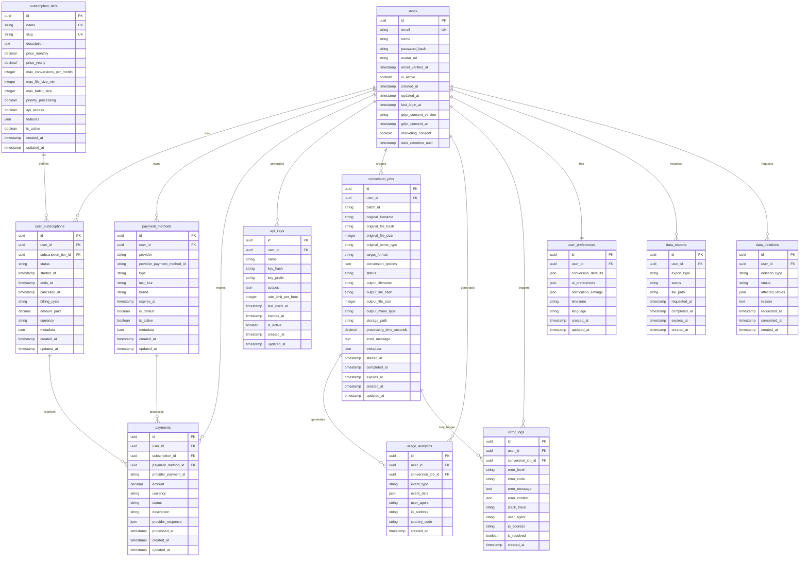

# HEIC Converter Database Schema

## Overview

This document defines the comprehensive database schema for the HEIC Converter application, including user management, subscription handling, conversion processing, analytics, and GDPR compliance.

## Entity Relationship Diagram



## Table Definitions

### Core User Management

#### users

Primary user entity with GDPR compliance fields.

| Column               | Type      | Constraints      | Description                   |
| -------------------- | --------- | ---------------- | ----------------------------- |
| id                   | uuid      | PRIMARY KEY      | Unique user identifier        |
| email                | string    | UNIQUE, NOT NULL | User email address            |
| name                 | string    | NOT NULL         | User display name             |
| password_hash        | string    | NOT NULL         | Bcrypt hashed password        |
| avatar_url           | string    | NULL             | Profile picture URL           |
| email_verified_at    | timestamp | NULL             | Email verification timestamp  |
| is_active            | boolean   | DEFAULT true     | Account active status         |
| created_at           | timestamp | NOT NULL         | Account creation time         |
| updated_at           | timestamp | NOT NULL         | Last update time              |
| last_login_at        | timestamp | NULL             | Last login timestamp          |
| gdpr_consent_version | string    | NOT NULL         | GDPR consent version accepted |
| gdpr_consent_at      | timestamp | NOT NULL         | GDPR consent timestamp        |
| marketing_consent    | boolean   | DEFAULT false    | Marketing emails consent      |
| data_retention_until | timestamp | NULL             | Data retention deadline       |

#### user_preferences

User-specific settings and preferences.

| Column                | Type      | Constraints   | Description                 |
| --------------------- | --------- | ------------- | --------------------------- |
| id                    | uuid      | PRIMARY KEY   | Unique preference ID        |
| user_id               | uuid      | FK users(id)  | User reference              |
| conversion_defaults   | json      | NULL          | Default conversion settings |
| ui_preferences        | json      | NULL          | UI customization settings   |
| notification_settings | json      | NULL          | Notification preferences    |
| timezone              | string    | DEFAULT 'UTC' | User timezone               |
| language              | string    | DEFAULT 'en'  | Preferred language          |
| created_at            | timestamp | NOT NULL      | Creation time               |
| updated_at            | timestamp | NOT NULL      | Last update time            |

### Subscription & Billing

#### subscription_tiers

Available subscription plans and their limits.

| Column                    | Type          | Constraints      | Description              |
| ------------------------- | ------------- | ---------------- | ------------------------ |
| id                        | uuid          | PRIMARY KEY      | Unique tier ID           |
| name                      | string        | UNIQUE, NOT NULL | Tier display name        |
| slug                      | string        | UNIQUE, NOT NULL | URL-friendly identifier  |
| description               | text          | NULL             | Tier description         |
| price_monthly             | decimal(10,2) | NOT NULL         | Monthly price            |
| price_yearly              | decimal(10,2) | NOT NULL         | Yearly price             |
| max_conversions_per_month | integer       | NOT NULL         | Monthly conversion limit |
| max_file_size_mb          | integer       | NOT NULL         | File size limit in MB    |
| max_batch_size            | integer       | NOT NULL         | Batch processing limit   |
| priority_processing       | boolean       | DEFAULT false    | Priority queue access    |
| api_access                | boolean       | DEFAULT false    | API access enabled       |
| features                  | json          | NULL             | Additional features      |
| is_active                 | boolean       | DEFAULT true     | Tier availability        |
| created_at                | timestamp     | NOT NULL         | Creation time            |
| updated_at                | timestamp     | NOT NULL         | Last update time         |

#### user_subscriptions

User subscription records.

| Column               | Type          | Constraints               | Description                  |
| -------------------- | ------------- | ------------------------- | ---------------------------- |
| id                   | uuid          | PRIMARY KEY               | Unique subscription ID       |
| user_id              | uuid          | FK users(id)              | User reference               |
| subscription_tier_id | uuid          | FK subscription_tiers(id) | Tier reference               |
| status               | string        | NOT NULL                  | active, cancelled, expired   |
| started_at           | timestamp     | NOT NULL                  | Subscription start date      |
| ends_at              | timestamp     | NOT NULL                  | Subscription end date        |
| cancelled_at         | timestamp     | NULL                      | Cancellation timestamp       |
| billing_cycle        | string        | NOT NULL                  | monthly, yearly              |
| amount_paid          | decimal(10,2) | NOT NULL                  | Amount paid                  |
| currency             | string        | NOT NULL                  | Payment currency             |
| metadata             | json          | NULL                      | Additional subscription data |
| created_at           | timestamp     | NOT NULL                  | Creation time                |
| updated_at           | timestamp     | NOT NULL                  | Last update time             |

#### payment_methods

Stored payment method information.

| Column                     | Type      | Constraints   | Description              |
| -------------------------- | --------- | ------------- | ------------------------ |
| id                         | uuid      | PRIMARY KEY   | Unique payment method ID |
| user_id                    | uuid      | FK users(id)  | User reference           |
| provider                   | string    | NOT NULL      | stripe, paypal, etc.     |
| provider_payment_method_id | string    | NOT NULL      | Provider's method ID     |
| type                       | string    | NOT NULL      | card, bank_account, etc. |
| last_four                  | string    | NULL          | Last 4 digits            |
| brand                      | string    | NULL          | Card brand               |
| expires_at                 | timestamp | NULL          | Expiration date          |
| is_default                 | boolean   | DEFAULT false | Default payment method   |
| is_active                  | boolean   | DEFAULT true  | Method active status     |
| metadata                   | json      | NULL          | Additional method data   |
| created_at                 | timestamp | NOT NULL      | Creation time            |
| updated_at                 | timestamp | NOT NULL      | Last update time         |

#### payments

Payment transaction records.

| Column              | Type          | Constraints               | Description                |
| ------------------- | ------------- | ------------------------- | -------------------------- |
| id                  | uuid          | PRIMARY KEY               | Unique payment ID          |
| user_id             | uuid          | FK users(id)              | User reference             |
| subscription_id     | uuid          | FK user_subscriptions(id) | Subscription reference     |
| payment_method_id   | uuid          | FK payment_methods(id)    | Payment method reference   |
| provider_payment_id | string        | NOT NULL                  | Provider transaction ID    |
| amount              | decimal(10,2) | NOT NULL                  | Payment amount             |
| currency            | string        | NOT NULL                  | Payment currency           |
| status              | string        | NOT NULL                  | succeeded, failed, pending |
| description         | string        | NULL                      | Payment description        |
| provider_response   | json          | NULL                      | Full provider response     |
| processed_at        | timestamp     | NULL                      | Processing timestamp       |
| created_at          | timestamp     | NOT NULL                  | Creation time              |
| updated_at          | timestamp     | NOT NULL                  | Last update time           |

### API Management

#### api_keys

API key management for programmatic access.

| Column              | Type      | Constraints      | Description          |
| ------------------- | --------- | ---------------- | -------------------- |
| id                  | uuid      | PRIMARY KEY      | Unique API key ID    |
| user_id             | uuid      | FK users(id)     | User reference       |
| name                | string    | NOT NULL         | Key display name     |
| key_hash            | string    | UNIQUE, NOT NULL | Hashed API key       |
| key_prefix          | string    | NOT NULL         | Visible key prefix   |
| scopes              | json      | NOT NULL         | API permissions      |
| rate_limit_per_hour | integer   | NOT NULL         | Hourly rate limit    |
| last_used_at        | timestamp | NULL             | Last usage timestamp |
| expires_at          | timestamp | NULL             | Expiration date      |
| is_active           | boolean   | DEFAULT true     | Key active status    |
| created_at          | timestamp | NOT NULL         | Creation time        |
| updated_at          | timestamp | NOT NULL         | Last update time     |

### File Processing

#### conversion_jobs

File conversion job tracking.

| Column                  | Type          | Constraints  | Description                            |
| ----------------------- | ------------- | ------------ | -------------------------------------- |
| id                      | uuid          | PRIMARY KEY  | Unique job ID                          |
| user_id                 | uuid          | FK users(id) | User reference                         |
| batch_id                | string        | NULL         | Batch identifier                       |
| original_filename       | string        | NOT NULL     | Original file name                     |
| original_file_hash      | string        | NOT NULL     | File content hash                      |
| original_file_size      | integer       | NOT NULL     | File size in bytes                     |
| original_mime_type      | string        | NOT NULL     | Original MIME type                     |
| target_format           | string        | NOT NULL     | Target format                          |
| conversion_options      | json          | NULL         | Conversion parameters                  |
| status                  | string        | NOT NULL     | pending, processing, completed, failed |
| output_filename         | string        | NULL         | Generated file name                    |
| output_file_hash        | string        | NULL         | Output file hash                       |
| output_file_size        | integer       | NULL         | Output file size                       |
| output_mime_type        | string        | NULL         | Output MIME type                       |
| storage_path            | string        | NULL         | File storage location                  |
| processing_time_seconds | decimal(10,3) | NULL         | Processing duration                    |
| error_message           | text          | NULL         | Error details                          |
| metadata                | json          | NULL         | Additional job data                    |
| started_at              | timestamp     | NULL         | Processing start time                  |
| completed_at            | timestamp     | NULL         | Processing completion time             |
| expires_at              | timestamp     | NOT NULL     | File expiration time                   |
| created_at              | timestamp     | NOT NULL     | Creation time                          |
| updated_at              | timestamp     | NOT NULL     | Last update time                       |

### Analytics & Monitoring

#### usage_analytics

User behavior and usage tracking.

| Column            | Type      | Constraints            | Description         |
| ----------------- | --------- | ---------------------- | ------------------- |
| id                | uuid      | PRIMARY KEY            | Unique analytics ID |
| user_id           | uuid      | FK users(id)           | User reference      |
| conversion_job_id | uuid      | FK conversion_jobs(id) | Job reference       |
| event_type        | string    | NOT NULL               | Event category      |
| event_data        | json      | NULL                   | Event details       |
| user_agent        | string    | NULL                   | Browser user agent  |
| ip_address        | string    | NULL                   | Client IP address   |
| country_code      | string    | NULL                   | Geo location        |
| created_at        | timestamp | NOT NULL               | Event timestamp     |

#### error_logs

Application error tracking.

| Column            | Type      | Constraints            | Description            |
| ----------------- | --------- | ---------------------- | ---------------------- |
| id                | uuid      | PRIMARY KEY            | Unique error ID        |
| user_id           | uuid      | FK users(id)           | User reference         |
| conversion_job_id | uuid      | FK conversion_jobs(id) | Job reference          |
| error_level       | string    | NOT NULL               | error, warning, info   |
| error_code        | string    | NULL                   | Application error code |
| error_message     | text      | NOT NULL               | Error description      |
| error_context     | json      | NULL                   | Additional context     |
| stack_trace       | string    | NULL                   | Error stack trace      |
| user_agent        | string    | NULL                   | Browser user agent     |
| ip_address        | string    | NULL                   | Client IP address      |
| is_resolved       | boolean   | DEFAULT false          | Resolution status      |
| created_at        | timestamp | NOT NULL               | Error timestamp        |

### GDPR Compliance

#### data_exports

User data export requests (GDPR Article 20).

| Column       | Type      | Constraints  | Description                            |
| ------------ | --------- | ------------ | -------------------------------------- |
| id           | uuid      | PRIMARY KEY  | Unique export ID                       |
| user_id      | uuid      | FK users(id) | User reference                         |
| export_type  | string    | NOT NULL     | full, partial, specific                |
| status       | string    | NOT NULL     | pending, processing, completed, failed |
| file_path    | string    | NULL         | Export file location                   |
| requested_at | timestamp | NOT NULL     | Request timestamp                      |
| completed_at | timestamp | NULL         | Completion timestamp                   |
| expires_at   | timestamp | NOT NULL     | File expiration                        |
| created_at   | timestamp | NOT NULL     | Creation time                          |

#### data_deletions

User data deletion requests (GDPR Article 17).

| Column          | Type      | Constraints  | Description                            |
| --------------- | --------- | ------------ | -------------------------------------- |
| id              | uuid      | PRIMARY KEY  | Unique deletion ID                     |
| user_id         | uuid      | FK users(id) | User reference                         |
| deletion_type   | string    | NOT NULL     | account, data, specific                |
| status          | string    | NOT NULL     | pending, processing, completed, failed |
| affected_tables | json      | NOT NULL     | Tables/data affected                   |
| reason          | text      | NULL         | Deletion reason                        |
| requested_at    | timestamp | NOT NULL     | Request timestamp                      |
| completed_at    | timestamp | NULL         | Completion timestamp                   |
| created_at      | timestamp | NOT NULL     | Creation time                          |

## Data Retention Policies

### File Storage

- **Converted files**: 7 days for free users, 30 days for premium users
- **Original files**: Deleted immediately after conversion
- **Failed conversions**: 24 hours for debugging

### User Data

- **Active accounts**: Retained while account is active
- **Inactive accounts**: 2 years without login triggers deletion warning
- **Deleted accounts**: 30-day grace period, then permanent deletion

### Analytics Data

- **Usage analytics**: 2 years retention
- **Error logs**: 1 year retention
- **Payment records**: 7 years (tax requirements)

### GDPR Compliance

- **Consent records**: Permanent retention for legal compliance
- **Data export files**: 30 days retention
- **Deletion requests**: Permanent audit trail

## Indexes

```sql
-- Performance indexes
CREATE INDEX idx_users_email ON users(email);
CREATE INDEX idx_users_active ON users(is_active);
CREATE INDEX idx_conversion_jobs_user_status ON conversion_jobs(user_id, status);
CREATE INDEX idx_conversion_jobs_batch ON conversion_jobs(batch_id);
CREATE INDEX idx_conversion_jobs_expires ON conversion_jobs(expires_at);
CREATE INDEX idx_usage_analytics_user_created ON usage_analytics(user_id, created_at);
CREATE INDEX idx_error_logs_created ON error_logs(created_at);
CREATE INDEX idx_payments_user_created ON payments(user_id, created_at);
CREATE INDEX idx_api_keys_user_active ON api_keys(user_id, is_active);

-- GDPR compliance indexes
CREATE INDEX idx_users_retention ON users(data_retention_until);
CREATE INDEX idx_data_exports_expires ON data_exports(expires_at);
CREATE INDEX idx_data_deletions_status ON data_deletions(status);
```

## Security Considerations

### Data Encryption

- All passwords stored using bcrypt with salt rounds ≥ 12
- API keys stored as hashed values with visible prefixes
- Sensitive PII encrypted at rest
- File content hashed for integrity verification

### Access Control

- Row-level security for multi-tenant data isolation
- API rate limiting per user and subscription tier
- Audit logging for all data modifications
- Regular security assessments and penetration testing

### Privacy Protection

- IP address anonymization in analytics
- Geographic data aggregation only
- Optional data retention period reduction
- Clear consent mechanisms for all data collection
